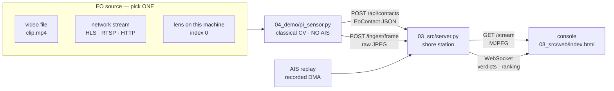

# VIDEO_SOURCES.md — the EO feed after the Raspberry Pi

**2026-08-29. Supersedes the Pi sensor path in `00_brief/HARDWARE.md`, `README.md` §Sensor node, and `04_demo/FAILOVER.md`.**

The Raspberry Pi and its camera module are out of the rig. The electro-optical source is
now **a video this machine decodes** — a file on disk, or a network stream off the
internet — and the console shows it.

Nothing downstream of the camera changed. `association`, `consistency`, `verdict`,
`prioritizer` and `evidence` are pure functions of `EoContact` + `AisTrack`, so only the
**producer** of `EoContact` moved. That was the point of the seam.

---

## 1. What runs now



**The node publishes the frame it detected on.** That is the whole design decision. The
console draws its boxes as an overlay on `/stream`; if the server decoded the video
*separately* there would be two decoders holding two independent positions in one file,
and the boxes would be painted over the wrong frame — drifting without bound on a loop.
One decoder, one clock, one observation.

---

## 2. Run it — the commands, and the three flags that decide everything

**Rewritten 2026-08-29 after `--live` gating and the two scene cuts. The commands in the
previous revision of this section start a detector you do not want and pass a pose that
is now ignored.**

### 2.0 The three flags, because everything below follows from them

| Flag | What it does | What it does NOT do |
|---|---|---|
| `--video <file\|url>` | Puts imagery on the console. The server decodes it and serves it on `/stream`. | **Does not start a detector.** It is a picture, not an observation. |
| `--live` | Starts `pi_sensor.py` on `--video`/`--camera` **and promotes it** — `initial_source` becomes `VIDEO_STREAM` (or `MAC_CAMERA`). The node then publishes the frame it detected on, so boxes and imagery are one observation. | Nothing else. Without it the authority stays `RECORDED`. |
| `--pose <json>` | The camera model every bearing is computed through. **Only read when a node runs**, i.e. only with `--live`. | Its default is `04_demo/camera_pose_TABLETOP.json`, whose `hfov_deg` is **0.0**. Pass that to a node and it refuses to start, correctly — a zero HFOV makes every bearing wrong. |

That pairing is the whole of the fix: `--video` alone used to launch a node anyway, which
then refused over the unfilled tabletop pose and printed an alarming `hfov_deg` error
into a T1 demo that was working perfectly.

### 2.1 Preconditions — check once, before the room fills

```bash
cd ~/Desktop/MaritimeApproaches
source .venv/bin/activate

# The WebSocket transport uvicorn does NOT bring with it. Without one, uvicorn answers
# 404 to the /ws upgrade — indistinguishable from a missing route — and the console
# silently degrades to 2 s polling. `pip install uvicorn` alone does not supply it.
python -c "import websockets; print('ws OK', websockets.__version__)" \
  || pip install websockets

# The scene assets. MEASURED 2026-08-29 (opencv in the Linux VM; decoding is
# platform-independent, so it carries to the Mac):
#   scene01/scene.mp4           1920x1080  12.00 fps  360 frames  30.0 s loop
#   scene01/scene_detector.mp4  1920x1080  12.00 fps  360 frames  30.0 s loop
#   scene02/scene.mp4           1920x1080  12.00 fps  360 frames  30.0 s loop
# First frame of each decodes and survives a JPEG encode with valid SOI/EOI markers,
# which is the exact byte path /stream serves.
ls -l 04_demo/out/scene01/scene.mp4 04_demo/out/scene01/scene_detector.mp4 \
      04_demo/out/scene01/camera_pose_SCENE.json
```

If any of the three is missing, regenerate — **and note the two cuts are two runs**:

```bash
python3 04_demo/make_scene_video.py --for recorded   # scene.mp4          (static hulls)
python3 04_demo/make_scene_video.py --for detector   # scene_detector.mp4 + the pose
```

Only the **detector** cut writes `camera_pose_SCENE.json`. Both cuts would write the same
filename with a different `time_lapse_factor`, so whichever ran last would leave the other
lying about its own time base. Nothing reads a pose for the recorded cut — no node runs
on it.

### 2.2 The commands

| Tier | Command | What lands on screen |
|---|---|---|
| **T1 — RECORDED. Pitch this one.** | `python3 03_src/main.py --video 04_demo/out/scene01/scene.mp4 --loop` | The scene's own rendering, with the recorded scene's ranked contacts drawn over it. No detector, no pose, nothing that can refuse to start. `/health` says *"scene rendering: this imagery was rendered from the very contacts drawn over it."* |
| **T1-LIVE — the real detector, on the rendered scene** | `python3 03_src/main.py --video 04_demo/out/scene01/scene_detector.mp4 --loop --live \`<br>`  --pose 04_demo/out/scene01/camera_pose_SCENE.json --scale 1` | MOG2 actually detects; the node publishes each frame it ran on; `/stream` relays it. `/health` says *"frame-synchronised: the node published the frame it detected on."* |
| **A lens on this machine** | `python3 03_src/main.py --camera 0 --live --scale 20 --pose <a pose you MEASURED>` | Live camera. `--scale 20` is the tabletop 1 cm = 20 m convention. |
| **A network stream** | `python3 03_src/main.py --video "https://host/live/index.m3u8" --live --scale 1 --pose <measured>` | Live imagery. Read §5 before pointing this at anything public. |
| **Scene 02** | `python3 03_src/main.py --scene 04_demo/out/scene02 --video 04_demo/out/scene02/scene.mp4 --loop` | **Recorded path only.** scene02 has neither a detector cut nor a pose sidecar, so `--live` has nothing to run on. |

Then open `http://127.0.0.1:8000/`. `main.py` opens it for you once `/health` answers —
it polls rather than opening immediately, because landing on connection-refused reads on
stage as a broken tool.

### 2.3 Confirm it is actually working — three scripts, then one curl

These are the confirmation. All three run a **real uvicorn on a real port**; nothing in
them is stubbed, which is the whole reason they exist — every earlier check called the
backend object directly, and that is how a route returning 422 to every POST survived.

```bash
# Generators in isolation: looping, pacing, JPEG validity, and that a stopped relay
# ENDS rather than freezing.               expected: 17/17
python3 99_scratch/lane_video_check.py

# The video pane through a real server: decode, relay hand-off, the "none configured"
# string, scene-rendering vs UNRELATED IMAGERY.   expected: 15/15
python3 99_scratch/lane_video_e2e.py

# pi_sensor.py as a SUBPROCESS against a real server: contacts arrive (200, not 422),
# are PROMOTED, frames relay, /stream switches.   expected: 8/8
python3 99_scratch/lane_node_to_server_check.py
```

Each prints its own PASS/FAIL lines and ends with `ALL CHECKS PASSED` or `FAILED: n`.

With the rig running, one call states the truth about the pane:

```bash
curl -s http://127.0.0.1:8000/health | python3 -m json.tool | sed -n '/"source"/,/}/p'
```

| `video_sync` begins | Meaning | Correct for |
|---|---|---|
| `scene rendering:` | Imagery is this scene's own rendering; the boxes do belong to the frame beneath them. Synthetic — no camera observed it. | **T1** |
| `frame-synchronised:` | The node published the frame it detected on. One decoder, one clock. | **T1-LIVE** |
| `reference imagery:` | Decoded independently of the detector — approximately the same picture, not the same frame. | acceptable |
| `UNRELATED IMAGERY:` | **Stop.** The contacts come from the RECORDED scene, not this video; every box is in the wrong place. Switch the source to `VIDEO_STREAM` — or drop `--live` and use the scene's own cut. | never |
| `no imagery` | No node publishing and no `--video` given. | never, on stage |

`source.video` is the other half: `none configured` · `decoding <src>` · `relayed from
node <id>`.

## 3. Where the changes are

| File | Change |
|---|---|
| `03_src/contracts.py` | `SensorKind` gains `video_stream`. `edge_pi` **kept, not deleted** — historical evidence records carry it, and a contract that cannot parse its own audit trail is worse than one with a retired member. |
| `03_src/source_switch.py` | `VIDEO_STREAM` replaces `EDGE_PI` in the selectable sources. `EDGE_PI` is still *recognised*, so a stray node gets "that source is retired" instead of "unknown source". |
| `03_src/server.py` | `_mjpeg_decode()` — decodes **any** cv2 source: index, path or URL. Files paced to native FPS and looped; live sources reconnected, bounded. `_FrameRelay` + `POST /ingest/frame` — the node publishes the frame it detected on. `/stream` precedence, `--video` flag, `/health` reports `video` + `video_sync`. |
| `04_demo/pi_sensor.py` | `--source` takes an index, a path **or a URL**; `--camera` is an accepted alias. New: `--loop`, `--publish-frames`, `--publish-fps`, `--node-id`, `--pace`. Declares its `kind` and `node_id` when posting. `frame_ref` scheme is now `cam://` \| `file://` \| `net://` instead of a blanket `pi://`. |
| `03_src/main.py` | New `--video`, `--loop`, `--node-id`. **Bug fixed:** it launched the node with `--camera`, which the node did not accept — the live path had never worked and failed silently. The active source now follows the flag. |
| `03_src/web/index.html` | `VIDEO` badge; new hint text; a standing caveat when the imagery is not what produced the boxes. |
| `04_demo/make_scene_video.py` | **New.** Renders the recorded scene's own contacts as a watermarked MP4, so the T1 path has imagery at all. |
| `99_scratch/lane_video_check.py` | **New.** Measures the generators in isolation — looping, pacing, JPEG validity, and that a stopped relay ends rather than freezing. 17/17. |
| `99_scratch/lane_video_e2e.py` | **New.** The video pane through a real `uvicorn`: decode, relay hand-off, the exact `none configured` string, the UNRELATED IMAGERY warning. 15/15. |
| `99_scratch/lane_node_to_server_check.py` | **New.** `pi_sensor.py` as a subprocess against a real server: contacts arrive, are promoted, frames relay, `/stream` switches. 8/8. |

---

## 3a. What the first real run uncovered

Three defects, each of which had been invisible because the one in front of it hid it.

| # | Defect | Why nothing caught it |
|---|---|---|
| 1 | `main.py` launched the node with `--camera`; the node's flag was `--source`. argparse exited 2 into an unread pipe. | The parent reported no error. A dead node looks exactly like a camera seeing nothing. |
| 2 | **Every** `POST` to `/ingest/contacts`, `/api/contacts` and `/ingest/frame` returned **422**. No observation from any sensor could ever reach the picture. | `from __future__ import annotations` makes annotations strings; FastAPI resolves them against *module* globals, but `Request` is imported inside `create_app()`. It therefore treated `request` as a missing query parameter. Every existing check called the backend object directly or ran against a stubbed `fastapi` — nothing had ever put a request on a socket and read the status back. |
| 3 | The recorded scene has **no imagery at all**, and never had. | The Pi was going to supply the picture, so nobody looked. |

Defect 2 is the serious one: the claimed/observed wall had exactly one doorway and it
was shut. Fixed by publishing `Request` and `WebSocket` into module globals inside
`create_app()` — the lazy import is preserved, so the module still imports on a machine
without the web stack.

**Guard against a repeat:** `99_scratch/lane_video_e2e.py` and
`99_scratch/lane_node_to_server_check.py` both run a real `uvicorn` on a real port. The
second launches `pi_sensor.py` as a subprocess and asserts its contacts arrive **and are
promoted**. Nothing in either is stubbed.

---

## 4. The three things that will bite

| Trap | What happens | Why |
|---|---|---|
| **Boxes over unrelated imagery** | Console shows a red banner: *UNRELATED IMAGERY — the contacts come from the RECORDED scene, not this video.* | `/stream` shows whatever imagery exists; `source_switch` decides whose **contacts** reach the picture. Leave the authority on `RECORDED` with a clip in the pane and every box is in the wrong place, with both halves working as designed. Switch the source to `VIDEO_STREAM`. |
| **One camera, two consumers** | `--camera 0` on the server *and* a node on index 0 — one of them loses. | macOS will not usually open the built-in camera twice. A file or a URL has no such limit, which is another reason `--video` is the flag to reach for. |
| **Background subtraction on a moving camera** | Contacts everywhere. | `pi_sensor.py` is MOG2: it detects *what changed against a background that does not move*. Drone footage, a panning webcam or a handheld clip breaks it completely. Use a **fixed** viewpoint. Moving water counts: an early version of `make_scene_video.py` animated swell and the detector found 11 waves and no ships. |
| **A vessel that is too far to appear to move** | Nothing is detected; the hull is learned into the background within seconds. | At 6 km a 14-knot vessel crosses ~2 px/s. That is why `make_scene_video.py` renders in compressed scene time (`--time-lapse`, default 60x) and states the factor in the watermark. Real footage of distant traffic has the same problem and no such dial. |
| **Range collapses to tens of metres** | Every contact reports an absurdly short range. | `find_horizon()` takes the row of maximum vertical gradient, and any full-width bar — a letterbox, a caption strip, a banner — beats a real horizon. Crop it out. |

---

## 5. Before you point it at the internet

| Check | Why |
|---|---|
| **Licence / terms of the feed** | Project rule: cite the licence on every feed. Many port webcams forbid redistribution or public demonstration. Record the terms in `02_data/DATASETS.md` before the feed is on a screen. |
| **People out of frame** | Vessels are the subject, not persons. Do not store identifiable imagery of individuals. A quayside webcam will have people in it. |
| **No real vessel named** | Live imagery plus live AIS names real ships and real companies. Identities are pseudonymised on every outbound route by default — leave `--allow-real-identities` **off**. |
| **The claim you make out loud** | A recorded clip or a third-party webcam is evidence of **the pipeline**, not evidence of **the sea**. The pose describes a camera that is not the one that shot the footage, so the bearings and ranges are arithmetic on an assumption. Say *"the detector and the fusion, running on real imagery at demo scale"*. Never *"our sensor watching the Elbe"*. |

---

## 6. If the video pane is empty

Read `/health` first — it states which source is live and why:

```bash
curl -s http://127.0.0.1:8000/health | python3 -m json.tool | grep -A6 '"source"'
```

| `source.video` says | Meaning | Fix |
|---|---|---|
| `none configured` | No node is publishing and no `--video` was given | Pass `--video <file\|url>` or `--camera 0` |
| `decoding <src>` | The server has the video, no node is publishing | Node died — check its output in the terminal |
| `relayed from node <id>` | Working as designed | — |
| `/stream` returns 503 | Same as `none configured`; the body names the flags | — |
| Stream stops mid-demo | A live source delivered nothing for 15 s, or the node stopped | **By design.** A frozen last frame on a watch screen is indistinguishable from a live view of calm water. |

---

## 7. Glossary

**AIS** Automatic Identification System · **EO** Electro-Optical · **FPS** Frames Per
Second · **HLS** HTTP Live Streaming (`.m3u8` playlist) · **MJPEG** Motion JPEG, served
as `multipart/x-mixed-replace` · **MOG2** Mixture of Gaussians background subtractor ·
**RTSP** Real Time Streaming Protocol · **SOI/EOI** JPEG start/end-of-image markers ·
**T1** recorded EO + historical AIS, the guaranteed demo tier · **T2** live EO + live AIS
